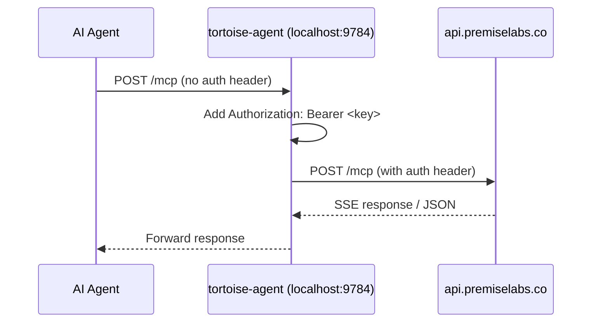

---
<<<<<<< HEAD
title: "Tortoise Agent Daemon — Research Brief"
type: engineering
subjects.team: epistemic-team
domain: platform
doc_status: draft
aboutSubjects: tortoise
aboutObjects: tortoise-agent
created: 2026-09-08
---

# Research: Tortoise Agent Daemon

**Date:** 2026-09-08
**Request:** Design a small background process (`tortoise-agent`) that holds an API key in memory, listens on localhost:9784, and proxies MCP requests from the user's agent to api.premiselabs.co.

## Problem reframing (Step 0)

- **Reframed:** This is a secure credential proxy daemon that eliminates the need for every agent harness to manage Tortoise API keys directly. Instead of handing the key to the agent (where it may leak into config files, session logs, or prompt context), the daemon holds the key in-process memory and the agent talks to localhost. The daemon is a *general-purpose MCP proxy* — not Tortoise-specific on the wire — but its *lifecycle and distribution* are Tortoise-specific (bundled with the installer, managed via `tortoise agent` CLI).
- **Domain classification:** Complicated (engineering). The pieces are well-understood: HTTP proxy, in-memory credential management, OS-level daemon lifecycle, MCP protocol transport. Integration surfaces with existing installer, CLI, session capture, and dashboard are where complexity lies.

---

## 1. MCP Proxy Reference Implementations

### 1.1 Apify `mcpc` — proxy mode

**Source:** [github.com/apify/mcpc](https://github.com/apify/mcpc), blog.apify.com

`mcpc` is a universal CLI client for MCP that runs as a shell command. Its proxy mode (`--proxy <port>`) exposes any stdio-based MCP server over HTTP on localhost.

**Key patterns:**
- `mcpc connect <server> @<session> --proxy 8080` — connects to a remote MCP server over Streamable HTTP, then exposes a local proxy on port 8080.
- AI-generated code in sandboxed environments talks to `localhost:8080` without ever seeing OAuth tokens.
- Uses OS keychain (Secret Service API on Linux, Keychain on macOS) for credential storage.
- Falls back to `~/.mcpc/credentials.json` (mode 0600) on headless/CI.
- The proxy is a *second-class feature* — it exists to sandbox credentials, not as the primary interface.

**Relevance:** The proxy pattern (local HTTP → remote MCP forwarding with credential isolation) is exactly what Tortoise needs. The key difference: Tortoise's daemon is the *primary* interface, not a sandboxing add-on.

### 1.2 punkpeye `mcp-proxy`

**Source:** [github.com/punkpeye/mcp-proxy](https://github.com/punkpeye/mcp-proxy), npm `mcp-proxy`

A TypeScript Streamable HTTP/SSE proxy for stdio-based MCP servers. Two modes:
1. **stdio → SSE/StreamableHTTP:** wraps a local stdio MCP server as an HTTP endpoint.
2. **SSE → stdio:** bridges remote SSE servers to local stdio clients.

**Key patterns:**
- `mcp-proxy http://remote-mcp-server.io/sse` — starts a local proxy that forwards to a remote SSE endpoint.
- Passes `Authorization` headers via `--headers` or `API_ACCESS_TOKEN` env var.
- Supports OAuth 2.1 client credentials flow.
- Configured in Claude Desktop's `mcpServers` stanza as a local command.

**Relevance:** The stdio→HTTP bridge pattern is the closest reference. Tortoise's daemon reverses this — it's an HTTP server (agent connects via Streamable HTTP) that proxies to a remote HTTP server. The header-forwarding pattern (Bearer token on every MCP request) is directly applicable.

### 1.3 sparfenyuk `mcp-proxy` (Python)

**Source:** [github.com/sparfenyuk/mcp-proxy](https://github.com/sparfenyuk/mcp-proxy), PyPI `mcp-proxy`

A Python implementation of the same proxy concept. Uses `uvx` as the default runner.

**Key patterns:**
- Two modes: stdio→SSE/StreamableHTTP and SSE→stdio.
- `--headers` for auth tokens, `--transport` flag to select protocol.
- Config-driven named servers via JSON file.

**Relevance:** Being Python (Tortoise's language), this is the most directly forkable/referenceable codebase. The architecture of wrapping stdio servers as HTTP endpoints is the same pattern.

### Synthesis

| Feature | mcpc (Apify) | mcp-proxy (punkpeye) | mcp-proxy (sparfenyuk) |
|---|---|---|---|
| Language | TypeScript | TypeScript | Python |
| Proxy direction | stdio→HTTP (sandbox) | stdio↔SSE/HTTP | stdio↔SSE/HTTP |
| Auth forwarding | Keychain → headers | `--headers`/env | `--headers`/env |
| Lifecycle | Manual CLI | Manual CLI | Manual CLI |
| Credential isolation | OS keychain | Env/CLI | Env/CLI |
| Localhost binding | Default | Default (`127.0.0.1`) | Configurable |

**None of these handle daemon lifecycle (launchd/systemd). That's the gap Tortoise fills.**

---

## 2. Simplest Implementation Architecture

### Option A: Pure HTTP proxy (recommended for v1)

The daemon is a minimal async HTTP server that:
1. Listens on `localhost:9784` for POST requests.
2. Forwards each POST to `https://api.premiselabs.co/mcp` with the in-memory `Authorization: Bearer <key>` header added.
3. Streams the response back to the agent.
4. Never reads the key from disk after initial load.



### Option B: stdio relay

The daemon exposes a stdio interface that agents talk to via subprocess. Less flexible — most modern agents prefer HTTP MCP endpoints.

**Verdict:** HTTP proxy (Option A) is the simplest and most compatible. The MCP Streamable HTTP transport is the standard, and every major agent harness (Claude Code, Cursor, Codex, OpenCode, Pi via MCP extension) supports connecting to an HTTP MCP endpoint.

### Protocol details

- The daemon serves on `http://localhost:9784/mcp` as a single POST endpoint (standard Streamable HTTP server endpoint).
- MCP protocol requires `Content-Type: application/json` on POST, and expects response as either JSON or SSE stream.
- The daemon MUST forward ALL request headers from the agent EXCEPT `Authorization` (which it overrides with its own in-memory token).
- The daemon MUST forward `MCP-Protocol-Version`, `Mcp-Method`, `Mcp-Name` headers (per MCP spec).
- The daemon does NOT need to parse or understand MCP messages — it's a transparent proxy.

---

## 3. Lifecycle Management

### 3.1 macOS: launchd

The existing `scripts/install-launchd.sh` provides the infrastructure. The daemon would:
- Install a `~/Library/LaunchAgents/co.premiselabs.tortoise-agent.plist` on install.
- Launchd auto-starts on login, restarts on crash (`KeepAlive` with `ThrottleInterval`), and runs as the user.
- The plist binds `SockNodeName` + `SockPathMode` for socket-activated localhost binding, OR sets `--port 9784` in `ProgramArguments`.

**Key launchd properties:**
```xml
<key>KeepAlive</key>
<true/>
<key>ThrottleInterval</key>
<integer>5</integer>
<key>RunAtLoad</key>
<true/>
<key>EnvironmentVariables</key>
<dict>
    <key>PATH</key>
    <string>/opt/homebrew/bin:/usr/local/bin:/usr/bin</string>
    <key>HOME</key>
    <string>/Users/&lt;user&gt;</string>
</dict>
```

### 3.2 Linux: systemd

User-level systemd service at `~/.config/systemd/user/tortoise-agent.service`:
```ini
[Unit]
Description=Tortoise Agent Daemon
After=network.target

[Service]
Type=simple
ExecStart=/usr/local/bin/tortoise-agent
Restart=always
RestartSec=5
Environment="HOME=%h"

[Install]
WantedBy=default.target
```

### 3.3 Auto-start via profile (fallback)

For environments without launchd/systemd (containers, WSL, minimal Linux):
```bash
# ~/.profile or ~/.bashrc
if ! pgrep -f "tortoise-agent"; then
    nohup tortoise-agent --daemonize >/dev/null 2>&1 &
fi
```

### 3.4 Port conflicts

- Default port: 9784 (registered at `IANA` / in-project convention).
- `--port` flag for override.
- Health check on startup: bind attempt fails fast with clear error.
- `tortoise agent status` reports the actual bound port.

### 3.5 Crash resilience

- `KeepAlive` (launchd) / `Restart=always` (systemd) handles the process crash case.
- Graceful shutdown on `SIGTERM` (flush pending writes, close key memory).
- PID file at `~/.tortoise/agent.pid` for non-service-managed environments.

---

## 4. Session Capture Integration

The daemon sees every MCP call because it proxies every request. This is a natural hook for session capture.

### How it works

1. Every HTTP request arriving at `localhost:9784/mcp` is visible to the daemon.
2. The daemon can journal request/response pairs to `~/.tortoise/sessions/` — a JSONL event stream of MCP calls.
3. These session logs are consumed by the existing `session-postmortem.sh` infrastructure (`scripts/session-postmortem.sh`).

### Integration point

The daemon doesn't need to *understand* MCP messages to capture sessions — it just needs to log the raw HTTP bodies:
```json
{"ts": "...", "method": "tools/call", "params": {...}, "result": {...}}
```

### v1 scope

In v1, session capture is OFF by default (avoid surprising users with file writes). It becomes opt-in via `tortoise agent config set session-capture true`. Phase 3 (plan) makes it built-in.

### Security consideration

Session logs contain the full MCP request/response — potentially including sensitive data in tool parameters or results. The log file must be `~/.tortoise/sessions/` with mode 0600, and rotation must be built in (max 10MB, oldest rotated out).

---

## 5. Offline Resilience

### Problem

The daemon proxies to api.premiselabs.co. If the network is down, the daemon can't forward requests. But the user's agent still tries to connect — MCP returns an error immediately.

### v1 behavior (fail-fast)

- Daemon detects network unavailability → returns HTTP 502 (Bad Gateway) to the agent.
- Agent sees the error and retries (MCP client built-in retry or user re-prompt).
- No buffer, no replay — keep it simple.

### v2 behavior (buffer + replay)

- Daemon detects network unavailability → buffers requests to a capped JSONL file (`~/.tortoise/outbox/`).
- On reconnect, replays buffered writes in order.
- Hard cap: 1000 entries or 10MB, whichever hits first (oldest dropped).
- This is useful for *session capture writes* (non-critical) and *read-only graph mutations* if those exist. Write mutations (create_point, etc.) still fail — stale writes are worse than no writes.

### Decision

Fail-fast for v1 (phase 1-3). Buffer writes (offline resilience) is phase 4.

---

## 6. CLI Surface Design

All commands under `tortoise agent`:

| Command | Description |
|---|---|
| `tortoise agent start` | Launch the daemon (install + start if not running) |
| `tortoise agent stop` | Graceful shutdown (SIGTERM) |
| `tortoise agent status` | Running? PID? Port? Uptime? Key status? |
| `tortoise agent restart` | Stop then start |
| `tortoise agent logs` | Tail daemon logs |
| `tortoise agent config` | View/set config (port, session-capture, etc.) |

These map to the existing `__main__.py` CLI parser (`python -m tortoise agent <subcommand>`).

---

## 7. Minimum Viable Implementation

### Estimated effort: 3-4 weeks (one engineer)

| Component | Effort | Dependencies |
|---|---|---|
| Core daemon (aiohttp HTTP proxy) | 3 days | asyncio, aiohttp |
| In-memory key management | 1 day | env var ← API key at start |
| `tortoise agent` CLI subcommands | 2 days | argparse, existing `__main__.py` |
| launchd plist + installer integration | 2 days | install-launchd.sh pattern |
| systemd user service | 1 day | template .service file |
| Health + status endpoint | 1 day | daemon serves GET /health |
| Session capture (v1 opt-in) | 2 days | JSONL writer, rotation |
| Offline resilience (v2) | 3 days | outbox buffer, replay |
| Cross-platform testing | 3 days | macOS + Linux CI |
| Documentation | 1 day | README, CLI --help |
| **Total (v1, no session capture)** | **~2 weeks** | |
| **Total (v1 + session capture)** | **~3 weeks** | |
| **Total (v1–v3)** | **~4 weeks** | |

### v1 is:

1. A single Python script (`tortoise-agent` or `tortoise/agent_daemon.py` + `__main__.py` entry)
2. Uses aiohttp for async HTTP proxy
3. Accepts API key via env var `TORTOISE_API_KEY` (daemon reads it at startup, never writes it)
4. Listens on localhost:9784
5. Forwards POST `/mcp` to api.premiselabs.co
6. `tortoise agent start|stop|status` CLI commands
7. launchd plist installation (macOS)
8. systemd user service installation (Linux)
9. Health endpoint at `GET /health`

### Not in v1:

- Session capture
- Offline resilience / outbox buffer
- Dashboard integration (health reports, session list)
- Multi-key management
- TLS termination (localhost-only, no TLS needed)

---

## 8. Key Design Decisions

### 8.1 Python vs compiled binary

**Decision: Python.** The daemon runs in the user's environment alongside the SDK. Python is already a dependency (Tortoise SDK is Python). The daemon can be a small aiohttp server in `tortoise/agent_daemon.py`. This avoids shipping a separate binary, keeps the codebase homogeneous, and simplifies debugging.

**Tradeoff:** Python startup latency (~100ms) is irrelevant for a long-running daemon. Memory overhead (~30MB for the Python runtime) is acceptable for a background process.

### 8.2 Single-threaded async vs multi-threaded

**Decision: Single-threaded asyncio (aiohttp).** MCP requests are I/O-bound (waiting on the remote API). A single event loop handles concurrent requests efficiently. No thread pool needed.

### 8.3 Key injection: env var vs file-based

**Decision: Environment variable (phase 1), then Stdin-based injection (phase 2).**

The installer (`curl ... | bash`) currently prints the API key discovery step. For the daemon:
1. Installer starts the daemon with `TORTOISE_API_KEY=<key> tortoise-agent start`.
2. Daemon reads `TORTOISE_API_KEY` on startup, stores it in a `_key: str` attribute, cleans the env var from its own environment.
3. Never writes the key to disk.
4. `tortoise agent status` reports `key: loaded` without revealing the key.

### 8.4 Configuration mechanism

**Decision: `~/.tortoise/config.toml` (created by `tortoise agent config`).**

Toml for consistency with existing project config patterns. Contains only non-secret config:
```toml
[daemon]
port = 9784
session_capture = false
log_level = "info"
```

The API key is NEVER in this file.

---

## 9. Open Questions

1. **How does the installer pass the API key to the daemon without exposing it in the process table?** `curl ... | bash` starts the daemon as `TORTOISE_API_KEY=... tortoise-agent start` — the key is briefly visible in `ps`. Mitigation: the daemon unsetenvs `TORTOISE_API_KEY` immediately on startup. Acceptable for v1; revisit if key exfiltration via `/proc` is a real threat.
2. **Should the daemon support multiple API keys?** (No — multi-key = multi-daemon-instance, or key rotation. The API handles multi-graph via different keys sent by different agents.)
3. **Should the daemon validate the key on startup?** (Yes — `GET /v1/me` or similar to verify the key is valid before accepting proxy requests. Fail fast with clear error.)
4. **Port collision handling?** (Auto-increment on conflict? Or fail with "port 9784 in use"? Fail-first with clear error is safer — the user explicitly chose a port or accepted the default.)

---

## Sources

- [github.com/apify/mcpc](https://github.com/apify/mcpc) — Apify's universal MCP CLI client with proxy mode
- [blog.apify.com/introducing-mcpc-universal-mcp-cli-client/](https://blog.apify.com/introducing-mcpc-universal-mcp-cli-client/) — Proxy for AI sandboxes
- [github.com/punkpeye/mcp-proxy](https://github.com/punkpeye/mcp-proxy) — TypeScript MCP proxy stdio↔HTTP
- [github.com/sparfenyuk/mcp-proxy](https://github.com/sparfenyuk/mcp-proxy) — Python MCP proxy
- [modelcontextprotocol.io/specification/2026-07-28/basic/transports/streamable-http](https://modelcontextprotocol.io/specification/2026-07-28/basic/transports/streamable-http) — MCP Streamable HTTP spec (auth headers, request metadata)
- Apple Developer: [Creating Launch Daemons and Agents](https://developer.apple.com/library/archive/documentation/MacOSX/Conceptual/BPSystemStartup/Chapters/CreatingLaunchdJobs.html) — launchd lifecycle patterns
- `scripts/install-launchd.sh` in-repo — existing launchd template installer
=======
title: "Epic Research Brief — Tortoise Agent Daemon (local MCP proxy for secure keyless setup)"
type: engineering
subjects.team: epistemic-team
domain: platform
doc_status: live
aboutSubjects: tortoise
aboutObjects: tortoise-agent
created: 2026-09-08
updated: 2026-09-08
supersedes: 2026-09-08 draft (uncommitted, same path)
---

<!-- Canonical epic-research brief contract (issue #231 D9): the five
###-level headings + ## Raw Notes are read by downstream consumers
(epic-scope, writing-plans Step A.1). Do not rename. -->

# Epic Research Brief — Tortoise Agent Daemon

> Epic #2554 — a local MCP proxy daemon for secure keyless setup.
> **Status:** refreshed 2026-09-08 after internal + external research. This
> brief **corrects and supersedes** the earlier draft (same path) which was
> written before verification against the codebase. The single most
> important correction: **hosted OAuth 2.1 for remote MCP (#524) is already
> live**, which changes the daemon's role from "the keyless answer" to "the
> answer for harnesses that cannot authorize, and for transport-level
> capture/offline" — see Strategy Context.

## Raw Notes (evidence ledger)

- 2026-09-08 — Internal: `git ls-files -s scripts` = `120000` symlink → `agent-infra/scripts`. `install-launchd.sh`, `install-tortoise-skills.sh`, `session-postmortem.sh` all live in **agent-infra**, not the tortoise repo. Epic touches 2 repos + website.
- 2026-09-08 — Internal: `pyproject.toml` deps = fastapi, httpx>=0.27, uvicorn>=0.23, fastmcp==3.4.6, numpy, scipy, falkordb(ite), pyyaml, prometheus-client, posthog, sentry-sdk, pyjwt. **No aiohttp.** Console scripts: `tortoise = tortoise.__main__:main`.
- 2026-09-08 — Internal: hosted MCP = `https://api.premiselabs.co/mcp/` (trailing slash; `app.mount("/mcp", mcp_http_app)` at hosted_api.py:20298; `/mcp` → `/mcp/` redirect per hosted_api.py:997-1002). Streamable HTTP only (no SSE transport server-side). FastMCP `create_http_app` reused for self-host `tortoise serve --http`.
- 2026-09-08 — Internal: mcp_auth.py accepts Bearer `tt_`/`tk_` (tenant keys, API_KEY_PREFIXES auth.py:98-101) **and `oat_` (OAuth 2.1 access tokens)** at the same `/mcp` boundary (mcp_auth.py:140-189). OAuth resolution = `tortoise.oauth.resolve_oauth_access_token`.
- 2026-09-08 — Internal: **OAuth 2.1 for remote MCP is implemented and live** — issue #524 MERGED (PR #1264 feat/524-oauth-mcp). `docs/oauth-mcp.md` status: implemented. Production checks: `/.well-known/oauth-protected-resource/mcp` and `/.well-known/oauth-authorization-server/mcp` both return 200 with valid metadata; AS metadata advertises `/oauth/authorize`, `/oauth/token`, `/register` (DCR), `/oauth/revoke`, PKCE S256, scopes `mcp`.
- 2026-09-08 — Internal: ADR-010 (accepted 2026-09-04, #2246) — auth planes doctrine: browser never holds an API key; machine plane = per-agent OAuth identity (Tier 1) or durable API key (Tier 2). "Agent connect = authorize, not copy" is the stated endgame (#1701). `docs/adr/ADR-010-auth-planes-session-agent-key.md`.
- 2026-09-08 — Internal: key stores today = env `TORTOISE_API_KEY` → `cwd/.tortoise` (legacy, plaintext api_key + api_url, 0600) → `~/.tortoise/credentials.json` (#1708 canonical). No `config.toml` convention in SDK. Project YAML configs exist (`config/routing.yaml`). pyproject/supabase use TOML. Claim "TOML for consistency with existing project config patterns" (old draft) is inaccurate — the SDK credential convention is JSON.
- 2026-09-08 — Internal: key validation on connect = `GET {api_url}/v1/team` with Bearer (init path __main__.py:353-395). **No `/v1/me` endpoint exists** — old draft's "GET /v1/me" is wrong; correct endpoint is `/v1/team`.
- 2026-09-08 — Internal: zero-email agent signup already exists — `tortoise signup` (`_cmd_signup`, mirrors Mem0 4-command key mint + Hindsight npx self-install per its own docstring), `/v1/agent/signup`, recovery `/v1/agent/recover`, `/v1/agent/token/revoke`, `st_` signup tokens (#1709). One-time-token infra exists.
- 2026-09-08 — Internal: **session capture already exists** at the harness-hook level: Claude Code hooks (`tortoise/claude-hooks/session-start.sh|session-end.sh`), Pi extension (`agent-infra/extensions/tortoise-capture`, `reflect-hook.ts` → `~/.tortoise/session-events/` JSONL + POST hosted), hosted `POST /v1/sessions` (capture_session, #1727), MCP tool `tortoise_session_capture`, dashboard Memory-sources capture rows. The daemon would be an *additional transport-level* capture point, not the first one.
- 2026-09-08 — Internal: connect-step copy (website/apps/dashboard/src/harnesses.js + wizardFlow.js) — fork-aware connect (build fork = API key + SDK snippet; self fork = harness picker + universal setup command). Structure traces to epic #1976 W1/W2 (#1997/#1998) in code comments; the fork-aware connect-step LAYOUT fix is PR #2572 (merged 2026-09-08, verified via GitHub; not yet on this worktree's origin/main snapshot at review time — hence the reviewer's miss). Self-fork commands deliberately use env-var indirection (`$TORTOISE_API_KEY`) in project-scoped files and only carry the literal key in the shell export / CLI one-liner. Legacy `HARNESS_INSTALL` blocks still embed literal keys. Wizard steps today (after #2553): org-create(0) → fork(1) → connect(2) → done(3); connect step is `wizardStep === 2` (matches #2572).
- 2026-09-08 — Internal: no `tortoise agent` subcommand exists; no port 9784 usage anywhere in repo. Port 9784 is **NOT IANA-registered** (checked IANA service-names CSV) — old draft's "registered at IANA / in-project convention" is false on the first half; usable as an unclaimed high port with collision handling.
- 2026-09-08 — External: MCP ecosystem auth direction = OAuth 2.1 authorize; API keys are the legacy fallback. Clients try pre-registered client info → Client ID Metadata Documents → Dynamic Client Registration → manual (2025-11-25 spec; WorkOS, den.dev). Remote/local hybrid: "phantom token" / localhost reverse-proxy pattern documented by API Stronghold, VibeProxy (daemon mode, dummy token → real key from keychain), LLM-API-Key-Proxy, agentgateway.
- 2026-09-08 — External: MCP proxy bridges exist (punkpeye mcp-proxy, sparfenyuk mcp-proxy, Apify mcpc proxy mode) but are stdio↔HTTP *transport* bridges + header forwarders — none do credential-daemon lifecycle (launchd/systemd) for a *remote-hosted* MCP endpoint with in-memory key. Gap confirmed.
- 2026-09-08 — External: env-var secrets are readable via `/proc/<pid>/environ`, crash dumps, child-process inheritance (env.dev, safeguard.sh, CyberArk, kenhaines.net). A raw key in a launchd/`Popen` env is visible to the same user + `/proc` readers. launchd `ProgramArguments` does NOT substitute env; use `EnvironmentVariables` or inject at runtime (serverfault, launchd.plist(5)).
- 2026-09-08 — External: competitor keyless onboarding: Mem0 `mem0 init --agent --json` (agent mints its own key, human claims later), Hindsight npx self-install, MEMANTO per-agent session tokens (client never holds the API key; activates agent → X-Session-Token). Tortoise already mirrors Mem0's CLI-mint with `tortoise signup`.
- 2026-09-08 — External: agent-observability proxies capture MCP traffic at a local MITM/proxy layer (Candor, TraceEagle, AgentLens) — validates the daemon-as-session-gateway concept but all are third-party SaaS; none tied to a first-party memory graph.

---

## Strategy Context

### The problem (confirmed, sharpened)

Self-fork users ("Use it for your own agents") connect N harnesses (Claude
Code, Codex, Cursor, Pi, Claude Desktop/Web) to the hosted Tortoise MCP
endpoint. Today every harness needs a machine credential and a config
statement. The connect step mints/shows a durable `tt_` key, and the wizard's
setup command (or the user's shell profile / project `.mcp.json`) carries it.
Resulting risks:

1. **Key leakage surface** — literal `tt_` keys in shell exports (history),
   legacy harness install blocks, `.env` files, pasted prompts; `.mcp.json`
   env-indirection mitigates project-file leakage but not shell/env exposure.
2. **Per-harness friction** — configure key + MCP URL in each harness;
   onboarding copy is per-harness and drifts.
3. **No transport-level capture / offline resilience** — the agent → API path
   has no local interception point (session capture exists only where a
   harness hook or extension exists).

### ⚠️ Strategic reframe: OAuth 2.1 already answers part of the problem

The MCP ecosystem's answer to "don't give the harness your raw key" is
**OAuth 2.1 authorize-not-copy**, and Tortoise **already ships it** for the
hosted endpoint (#524, PR #1264; `oat_` tokens accepted at `/mcp`;
discovery + DCR + PKCE live in production). ADR-010 (2026-09-04) declares the
strategic direction: *agent connect = authorize, not copy*, with API keys as
the Tier-2 machine credential for clients that cannot OAuth (CLI/scripts/CI,
some harness configs).

**Consequence for the epic:** a daemon whose *only* job is "hold the raw key
so harnesses don't see it" is partially redundant for OAuth-capable harnesses
(Claude Code, Cursor, ChatGPT, Claude Desktop via DCR — see UX patterns) and
would cut against ADR-010's direction if it re-introduced a single raw-key
credential as the recommended path. The daemon earns its place where OAuth
**cannot** reach:

- **Harnesses / contexts without interactive OAuth** (headless agents,
  subagents, CI-like flows, harnesses whose only config surface is a static
  header or env var).
- **Local, transport-level interception**: session capture for harnesses with
  no hook/extension, and offline buffering/replay.
- **A stable localhost URL** so per-harness config is identical and keyless
  (point every agent at `http://localhost:9784/mcp`, no credential).

So the epic's **decision space** (for scoping) is: (A) local proxy daemon
holding a machine credential (original framing), (B) daemon that itself uses
OAuth (performs the authorize flow / holds a refresh token, proxies with
`oat_` — never exposes the raw `tt_` key, aligns with ADR-010/#1701), or
(C) no daemon — push OAuth-only and keep raw keys for REST/CLI. The research
supports **B as the coherent v1 direction** (daemon = one authorize flow for
the machine, harnesses connect keylessly to localhost), with A's raw-key
injection only as a fallback bootstrap, and C as the null hypothesis to
falsify in scope. This is the key strategic decision to confirm at the scope
human gate.

### Market context

- Agent-memory incumbents (Mem0, Hindsight, Zep, Letta) sell hosted memory
  with an API key; Mem0's differentiator is *agent-initiated* signup
  (`mem0 init --agent`, no human), which Tortoise already mirrors via
  `tortoise signup`. None ship a first-party local credential daemon.
- The tooling layer is converging on OAuth for remote MCP (Claude, ChatGPT,
  Cursor all support DCR flows); "localhost proxy holding the secret" is a
  documented community pattern (phantom-token / VibeProxy / API Stronghold)
  for keeping secrets off the agent.
- A first-party daemon is a defensible wedge: one-time authorize + keyless
  localhost endpoint + transport capture is a UX no OAuth-per-harness flow
  gives (each OAuth-capable harness still needs its own authorize round-trip).

---

## UX Pattern Research

### Authorize-not-copy (OAuth) — what self-fork users get today at the hosted endpoint

- Claude Code / ChatGPT / Cursor / Claude Desktop support OAuth 2.1 DCR for
  remote MCP servers (code.claude.com docs; claude.com connector auth:
  `oauth_dcr`, `oauth_cimd`, static headers, none). Hosted Tortoise already
  serves the discovery metadata, so an OAuth-capable client pointed at
  `https://api.premiselabs.co/mcp/` can discover → register → authorize →
  receive `oat_` tokens without ever seeing a `tt_` key.
- **UX gap:** the wizard does not yet *route* self-fork users to authorize
  for these harnesses (the connect step still shows key-carrying commands);
  #1701 (ChatGPT harness) is the in-progress version of wiring authorize into
  the wizard. The daemon epic should not duplicate that work; it should
  coordinate with it (authorize where possible, daemon for the rest).

### Keyless localhost endpoint — the UX the daemon sells

- Community pattern: agent configured with a **dummy/phantom token** pointing
  at `http://localhost:<port>`; a local proxy swaps in the real credential
  upstream. User-facing wins: identical config across harnesses; no secret in
  any harness config; one place to rotate.
- Precedents: VibeProxy (daemon mode, OS keychain backing), LLM-API-Key-Proxy
  (port 8000, background app), mcp-proxy variants (transport bridge +
  `--headers`), Apify `mcpc` (`--proxy <port>`, keychain creds, sandbox
  creds from code).
- **Anti-patterns to avoid:** (1) an unauthenticated localhost proxy that any
  local process can use (must bind loopback only; consider a local-only
  bearer that the daemon mints, per phantom-token pattern); (2) putting the
  real key in the launchd plist `EnvironmentVariables` (visible via
  `launchctl print` / plist file); (3) a key that requires re-entry on every
  reboot (need a persisted non-plaintext bootstrap or an OAuth refresh token).

### Connect-step shape (#2572 is the current surface)

- Build fork (unchanged): create/reveal key + SDK snippet.
- Self fork: harness picker + universal setup command (env-indirection, key
  in shell export). A daemon option would add a **third self-fork branch**:
  "Install the Tortoise daemon (one authorize, all agents keyless)" with a
  single copyable `curl … | bash` or `tortoise agent setup` command and a
  "running" health confirmation — reusing the existing fork-aware connect
  step structure (wizardStep 2) rather than inventing a new flow.

---

## Workflow Pattern Research

- **Installer:** the existing installer is `install-tortoise-skills.sh`
  (agent-infra; served at `https://app.premiselabs.co/install-tortoise-skills.sh`);
  it installs skills into a harness dir and does NOT install a daemon or
  inject keys. Daemon distribution must be added either to this script or to
  the `tortoise` package post-install. The epic must touch agent-infra (the
  installer + any launchd template registry), tortoise (daemon code + CLI),
  and website (connect step copy).
- **launchd:** agent-infra already runs an idempotent template installer
  (`scripts/install-launchd.sh` renders `templates/launchd/*.plist` with
  `{{PLACEHOLDER}}` substitution, diffs, bootout/bootstrap on change). A
  `co.premiselabs.tortoise-agent` user LaunchAgent should follow this
  pattern (KeepAlive, ThrottleInterval, RunAtLoad) — but keep the key OUT of
  the plist.
- **systemd:** user service at `~/.config/systemd/user/tortoise-agent.service`
  (`Restart=always`, `RestartSec=5`), `loginctl enable-linger` caveat for
  user services without a login session.
- **Fallback:** profile/rc nohup guard for systems with no service manager
  (WSL/containers), matching the existing draft's plan.
- **Session capture workflow (existing, don't rebuild):** harness hooks
  (claude) / extension (pi) → local JSONL `~/.tortoise/session-events/` →
  hosted `POST /v1/sessions`. A daemon transport capture would write a
  *similar-shaped* JSONL and should reuse the same hosted ingest contract
  rather than inventing a parallel one. Offline buffering (draft phase 4)
  maps naturally onto the same JSONL-first, sync-later pattern already used
  by reflect-hook.

---

## Tech Stack Research

### Verified internal facts (correcting the old draft)

| Topic | Old draft claim | Verified reality |
|---|---|---|
| Server framework | aiohttp | **No aiohttp in repo.** FastAPI + uvicorn + httpx + fastmcp==3.4.6 already ship. Proxy can be built on httpx (upstream) + a thin ASGI app; aiohttp would be a NEW dep. |
| Key validation | `GET /v1/me` | No such endpoint. Connect validates via `GET /v1/team` (Bearer). |
| Config | `~/.tortoise/config.toml` | Credential convention is JSON (`~/.tortoise/credentials.json`); no SDK TOML config. Use JSON or TOML deliberately — decide in scope. |
| Port | "IANA-registered" | Not registered. Unclaimed high port is fine; collision handling required. |
| Session capture | daemon is the gateway | Harness-level capture already exists (hooks/extensions + hosted `/v1/sessions`). Daemon adds transport-level capture for hook-less harnesses. |
| MCP URL | `…/mcp` | Hosted endpoint is `…/mcp/` (trailing slash, redirect from `/mcp`). |
| Auth accepted at /mcp | raw key only | `tt_`/`tk_` **and** `oat_` (OAuth). |

### Options for the daemon core

1. **OAuth-refreshing local proxy (recommended direction — aligns with
   ADR-010/#1701).** The daemon performs ONE authorize (or accepts a
   bootstrap exchange) and holds a **refresh token**; it proxies agent
   requests to `/mcp` with short-lived `oat_` access tokens, refreshing
   transparently. Agents hold NO credential (localhost only, optional
   local-only phantom bearer). Aligns with the ecosystem (OAuth) and the
   platform's own auth planes. Requires: hosted refresh-token grant already
   exists (#524 rotating refresh); daemon must persist the refresh token
   safely (keychain via `keyring`? macOS Security; Linux Secret Service; or
   a 0600 file as Tier-2 fallback) — this is a scoping decision.
2. **Raw-key proxy (original framing).** Simpler v1; but keeps a `tt_` key as
   the machine credential (Tier-2 semantics), visible in process env unless
   injected via stdin/pipe. Fine as a fallback bootstrap; not the headline.
3. **No-daemon (OAuth-only).** Cheapest if the wizard routes OAuth-capable
   harnesses to authorize and raw keys remain for REST/CLI. Daemon then only
   serves capture/offline niches.

### Streaming/transport notes

- Hosted `/mcp` is Streamable HTTP; responses may be JSON or SSE stream. The
   proxy must stream upstream responses back (httpx `client.stream` /
   ASGI streaming; do NOT buffer whole SSE bodies).
- Forward ALL MCP headers (`MCP-Protocol-Version`, `Mcp-Session-Id`,
   `Accept`, `Content-Type`) except `Authorization` (daemon supplies its own)
   and hop-by-hop headers. Transparent to the protocol — no MCP parsing.
- Timeouts: upstream connect/read timeout (~10s), graceful shutdown draining
   in-flight streams (3s budget), 502 on upstream unreachable, 503 when no
   credential loaded.

### Dependencies / packaging

- Console script already exists (`tortoise = tortoise.__main__:main`); add
   `tortoise agent …` subcommand → new `tortoise/cli_agent.py` + hidden
   `_daemon` entry. Package ships `tortoise-graph` (PyPI). Tests: `uv run
   pytest tests/test_agent_daemon.py` etc. (docker lane per AGENTS.md; this
   surface is mostly local/loopback so embedded lane likely suffices).
- Python 3.12+, `from __future__ import annotations`, pathlib — per repo
   conventions.

### Config + lifecycle file layout (proposal, to confirm in scope)

- Base dir: `~/.tortoise/` (already canonical for credentials, session-events,
  db).
- Daemon config: extend `~/.tortoise/credentials.json`-adjacent JSON or a
  small `~/.tortoise/agent.json` (port, upstream URL, session-capture flag).
  PID file `~/.tortoise/agent.pid`; log `~/.tortoise/agent.log`.

---

## Assumptions Register

| # | Assumption | Confidence | Source | Validation Plan |
|---|---|---|---|---|
| A1 | Hosted OAuth 2.1 remote-MCP flow works end-to-end with real clients (DCR → authorize → `oat_` accepted at `/mcp`) | High (metadata live; code merged #524) | internal docs/oauth-mcp.md; production well-known 200s | Live connect test with Claude Code / a fastmcp OAuth client in scope spike |
| A2 | Some target self-fork harnesses/configs cannot or should not do interactive OAuth and still need a keyless local endpoint | Medium | external docs (static-header-only configs exist; headless agents) | Harness matrix review in scope; pick the minimum viable non-OAuth harness set |
| A3 | A local daemon proxying with rotating `oat_` tokens keeps the raw `tt_` key off every harness and off shell env | High | codebase + OAuth design | Security review of daemon key/refresh handling; no `tt_` in any generated harness config |
| A4 | Refresh-token persistence without a plaintext keychain file is achievable on target OSes (macOS Keychain / Secret Service / 0600 fallback) | Medium | external keyring patterns; VibeProxy precedent | Spike keyring vs 0600 file; decide v1 posture in scope |
| A5 | Transport-level session capture in the daemon adds value beyond existing harness hooks (hook-less harnesses) without double-capturing hooked harnesses | Medium | internal capture matrix | Capture dedup decision in scope (daemon capture only when no hook/extension present, or always-on opt-in) |
| A6 | `curl … | bash` installer (agent-infra) can be extended to install/start the daemon without breaking the skills-only contract | High | existing script structure | Installer integration test on macOS + Linux |
| A7 | launchd/systemd user-service restart semantics cover the daemon's crash profile without a key re-entry loop (ThrottleInterval / RestartSec + health-gated exit) | Medium | launchd/systemd docs; agent-infra plist patterns | Lifecycle test: kill → restart → key still loaded |
| A8 | A loopback-only, optionally phantom-token-gated localhost proxy is an acceptable local threat model | High | community pattern (phantom token); OWASP loopback guidance | Security review + docs |
| A9 | No existing `tortoise agent` CLI name collision and port 9784 is free on target machines | High | grep (no usage) | Runtime port-conflict test |
| A10 | Pi / our own harnesses can consume an http://localhost MCP endpoint (no stdio-only constraint) | Medium | harness MCP config shapes (pi supports URL MCP entries) | Live connect with Pi mcp-client in scope E2E |
| A11 | Hosted refresh tokens rotate with a ~30d TTL (`TORTOISE_OAUTH_REFRESH_TTL`); re-authorization after expiry is resolvable without user friction (browser re-auth or headless fallback) on target OSes | Medium | oauth.py TTL constants + docs/oauth-mcp.md (D5 rotating refresh) | Fold the expiry/re-auth path into A7's lifecycle test; spike headless re-auth posture in scope |

---

## Second-Pass Architecture Verdict (SD-1 REVISED — supersedes §Strategy Context Option A/B/C)

> **Added 2026-09-08 after targeted research requested by the epic owner:** "Is
> the suggested architecture the best one, or are we patching around debt?
> Research properly." This section supersedes the Option A/B/C framing in
> Strategy Context. Trigger questions: (1) best architecture vs debt; (2) how
> to segment solo/team/builder; (3) does OS keychain change anything.

### Verdict: the daemon as originally framed is largely debt — the clean architecture is per-agent OAuth + scoped keys, segmented

**The daemon (any variant that holds a credential and proxies for multiple
local harnesses) was solving a problem that OAuth 2.1 already solves more
cleanly, and it would reintroduce the exact anti-pattern (one shared
machine identity) that the hosted platform just spent #524 + ADR-010 moving
away from.** Evidence below.

### 1. Internal evidence — the platform already moved to authorize-not-copy

- Hosted OAuth 2.1 remote MCP is **live** (#524): `oat_` tokens accepted at
  `/mcp`, discovery + DCR + PKCE production-verified (200s on
  `/.well-known/*`). ADR-010 (accepted) makes per-agent OAuth Tier-1 and raw
  API keys Tier-2. The daemon's core premise (harness must hold a key) is
  false for OAuth-capable harnesses.
- **Our own harness gap:** pi's mcp-client extension supports **static
  headers only — NO OAuth** (verified: `~/.pi/agent/extensions/mcp-client/
  index.ts` builds `StreamableHTTPClientTransport` with `requestInit
  {headers}`; comment: "See #4105 for long-term fix (auto-refresh /
  per-agent tokens)"). So pi today genuinely needs a static credential →
  the *real* fix is OAuth support in pi's mcp-client (#4105), not a daemon
  to route around pi's limitation.
- Wizard connect step still shows key-carrying commands for self-fork
  (#2572 is layout-only; #1701 = the in-progress ChatGPT/OAuth routing). The
  debt is the wizard not yet routing OAuth-capable harnesses to authorize.

### 2. External evidence — the ecosystem converged on per-agent OAuth; shared machine proxies are an anti-pattern for attribution

- **MCP authorization direction:** OAuth 2.1 + PKCE is the baseline for
  remote production servers; API keys are for local single-user dev,
  internal, or server-to-server (mcpfind.org, praesidia.ai, m2ml.ai — all
  post-Nov-2025-spec). A remote-hosted endpoint whose primary auth is a raw
  key is nonstandard for conforming clients.
- **Attribution is table-stakes for shared memory:** Zep, Mem0, Notion,
  agent-memory.dev, Neo4j agent-memory all keep **per-agent / per-user
  identity + provenance** on every write (Zep: "every fact traces to its
  source episode"; agent-memory.dev: shared pool tags every write with
  AGENT_ID; Mem0: user_id/agent_id/run_id/org_id scopes). WorkOS + security
  guidance: "unique keys per agent, never shared"; shared service accounts
  break attribution + least-privilege (nhimg.org). **A localhost daemon that
  collapses N local harnesses into ONE upstream OAuth identity destroys
  exactly the per-agent provenance a memory product needs** — every agent
  on the machine files as the same identity.
- **Local-auth-proxy precedent is for UNTRUSTED code, not the user's own
  agents:** the "phantom token" / localhost-reverse-proxy pattern (API
  Stronghold, VibeProxy, Docker sandboxes, LangChain auth proxy, infisical
  broker, agentgateway) exists to keep secrets out of **sandboxed/untrusted
  code** (Docker/LangSmith sandboxes, AI-generated code). Tortoise's
  self-fork harnesses (Claude Code, Cursor, pi) are the user's own trusted
  agents — the sandbox threat model does not apply, so the proxy pattern is
  solving a problem Tortoise's segments don't have.
- **SaaS precedent:** shipping a background credential daemon to end users is
  unusual; the norm is OAuth short-lived tokens + scoped service accounts
  (Auth0 agent identity, 1Password non-human identities, gh/supabase CLI
  login with keychain).

### 3. Segment matrix — what each segment actually needs

| Segment | Who | Real need | Clean architecture | Daemon needed? |
|---|---|---|---|---|
| **Solo dev / personal memory** | one human, N local harnesses on their machine | file decisions/findings from Claude Code + pi + Cursor; don't want to paste keys everywhere | per-harness OAuth authorize (Claude Code/Cursor do DCR+PKCE natively); pi needs OAuth support (#4105) | **No** — fix pi's client instead of routing around it |
| **Team memory** | multiple humans, each with their own agents, sharing org memory | attribution (who filed what), per-member revocation, shared graph | per-agent OAuth per member (RFC 8707 resource → shared team graph); keys only for non-OAuth tooling | **No** — a per-machine daemon collapses per-member attribution and is one shared revoke point |
| **Builders** | build apps on top of Tortoise for THEIR customers | server-to-server access to their org's graph; no browser at runtime | scoped API keys per tenant (tk_ per-graph keys already ship, epic #2083) OR OAuth client_credentials (MCP extension; hosted lacks it today) | **No** — server-side; daemon is localhost/desktop-only |

**Where the daemon's residual value is real (and small):** transport-level
session capture for hook-less harnesses, and offline buffering — but these
can ride an OAuth-per-agent architecture (the daemon proxies but does NOT
need to own the identity; agents still authorize per-client), or be handled
by existing harness hooks/extension capture. They do not justify making a
credential-holding daemon the auth backbone.

### 4. Verdict on SD-1

- **REJECT Option A** (raw-key proxy) — redundant + anti-ADR-010.
- **REJECT Option B as the headline architecture** (OAuth-refreshing daemon
  holding one machine identity) — it patches pi's missing OAuth (#4105) and
  the wizard's missing authorize-routing (#1701) with always-on local
  infrastructure, and it collapses per-agent attribution.
- **ADOPT Option C′ (revised): per-agent OAuth authorize-not-copy as the
  backbone** (server already live) + scoped keys (tk_) for CLI/CI/builders +
  **fix the two real debt items**: (1) pi mcp-client OAuth (#4105),
  (2) wizard routing OAuth-capable harnesses to authorize (#1701 generalize
  beyond ChatGPT).
- **Narrow daemon scope (optional, later):** a credential-agnostic local
  capture/offline relay is a separate product decision, NOT the auth story.

### 5. Keychain / OS question (answer: yes it changes things — and that is another argument against the daemon)

- **Cross-platform keychain is real, and differs by OS:** macOS Keychain and
  Windows Credential Locker are always present; Linux Secret Service
  (gnome-keyring/KWallet) is usually present on desktop but **absent on
  headless/WSL/containers/CI** → the gh/supabase pattern is keychain with a
  **0600-plaintext fallback** (gh: "stores in system credential store, falls
  back to plain text file"; supabase CLI same; python `keyring` supports all
  four backends with the same caveats).
- **If the daemon holds the credential, the keychain question is OURS to
  solve on every OS** — launchd/systemd must start it without a keychain
  session unlocked (macOS login keychain is locked at boot until the user
  logs in), headless Linux has no Secret Service → you end up with a
  plaintext 0600 file anyway = "key on disk" returns through the back door.
- **If per-agent OAuth is used, keychain is the HARNESS's problem, not
  ours:** Claude Code / Cursor already implement OS keychain storage for
  their OAuth tokens cross-platform (that is why they ship OAuth). pi's
  mcp-client would store its own token the same way (#4105). We stop owning
  a secret-storage matrix entirely.
- **Windows specifically:** a Python daemon holding a credential needs
  Windows Credential Locker via keyring (works) but the "no OS service
  manager parity" problem remains (no launchd/systemd user units; Windows
  Service API or Task Scheduler) — the draft scope deferred Windows anyway,
  which is another sign the daemon is the wrong shape (it multiplies OS
  surface instead of shrinking it).
- **Conclusion:** OS keychain differences do not block an OAuth-per-agent
  design at all (delegated to clients), but they are a real cost center for
  a credential-holding daemon — confirming the daemon adds cross-OS debt
  rather than removing it.

---

## What This Means for Scope (handoff notes)

1. **Resolve the strategic fork first** (A: raw-key proxy / B: OAuth-refreshing
   daemon / C: no daemon) at the scope human gate. Research recommends **B** —
   it is the only option consistent with ADR-010, #1701, and the live #524
   OAuth surface, and it still delivers the epic's UX (keyless localhost,
   one-time setup, capture/offline hooks).
2. **Coordinate, don't duplicate, the OAuth wizard work** (#1701) — the daemon
   is the complement for non-OAuth/headless contexts, not a replacement for
   authorize-not-copy.
3. **Correct the record** in the plan: no aiohttp (use httpx+ASGI), no
   `/v1/me` (use `/v1/team`), hosted URL has trailing slash, port 9784 is not
   IANA-registered, installer is agent-infra-owned.
4. **Right-size phases:** v1 = daemon core (B) + CLI + lifecycle + installer;
   transport capture and offline buffering reuse existing JSONL/hosted-ingest
   patterns rather than new infra.
5. **Deliverable repos:** tortoise (daemon + CLI + tests), agent-infra
   (installer extension + optional launchd template), website (self-fork
   connect-step branch + dashboard "daemon running" health, phase 2+).
6. **Identity granularity vs ADR-010 Tier-1 (decide in scope):** Option B
   collapses ADR-010's **per-agent** OAuth identity into a single upstream
   machine identity shared by every local harness — shared memory
   attribution and one revocation point for all local agents. Confirm
   whether all local harnesses share the daemon's single upstream identity
   (accepted consequence: shared attribution, single revoke) or the daemon
   maintains per-harness local credentials; state the trade-off against
   ADR-010's per-agent granularity explicitly.

## Sources

- Internal (verified): tortoise/__main__.py, tortoise/mcp_auth.py,
  tortoise/mcp_server.py, tortoise/oauth.py, tortoise/hosted_api.py
  (lines cited in Raw Notes), pyproject.toml, docs/oauth-mcp.md,
  docs/adr/ADR-010-auth-planes-session-agent-key.md,
  docs/research/2026-09-02-api-keys-table-session-credentials.md,
  website/apps/dashboard/src/{harnesses.js,main.jsx,wizardFlow.js},
  agent-infra scripts/install-launchd.sh + templates/launchd/*,
  agent-infra extensions/{tortoise-capture,reflect-hook}.ts,
  production `/.well-known/*` checks.
- External: modelcontextprotocol.io authorization spec (2025-11-25/2025-06-18),
  code.claude.com/docs/en/mcp, claude.com connectors auth docs,
  workos.com/blog/mcp-client-registration-cimd-vs-dcr, github.com/punkpeye/mcp-proxy,
  github.com/sparfenyuk/mcp-proxy, github.com/apify/mcpc, VibeProxy,
  apistronghold.com (phantom-token / localhost reverse proxy), agentcage.ai,
  traceeagle.com/ai-mcp, candor.codes, launchd.plist(5), env.dev +
  safeguard.sh + cyberark (env-var secret risks), mem0.ai (agent-mode
  signup), MEMANTO auth docs.
- External (second pass, 2026-09-08): mcpfind.org + praesidia.ai + m2ml.ai
  (OAuth-vs-API-key posture post-Nov-2025 spec); modelcontextprotocol.io
  extensions (client matrix, oauth-client-credentials); workos.com
  ai-agent-secrets-management + developers-guide (per-agent keys, never
  shared); nhimg.org mcp-server-identity (shared service accounts break
  attribution); blog.getzep.com/agent-memory-mcp + agent-memory.dev team-
  memory + neo4j agent-memory sharing + mem0 state-of-agent-memory-2026
  (per-agent/per-user provenance as table stakes); docker.com ai/sandbox
  credentials + langchain auth-proxy + infisical credential-brokering +
  jumpcloud credential-proxy sidecar (proxy pattern = untrusted/sandboxed
  code); auth0.com ai-agent-identity-saas + 1password non-human identities
  (OAuth/short-lived over daemons); cli.github.com gh_auth_login +
  supabase CLI + aws sso (CLI keychain + plaintext fallback); pypi keyring
  (macOS Keychain / Windows Credential Locker / Secret Service / KWallet);
  cursor.com/docs/mcp + truefoundry cursor-oauth (Cursor OAuth DCR/PKCE);
  pi.dev pi-mcp-adapter docs (OAuth for HTTP transports); internal
  `~/.pi/agent/extensions/mcp-client/index.ts` (pi static-headers-only,
  #4105).
>>>>>>> origin/main
