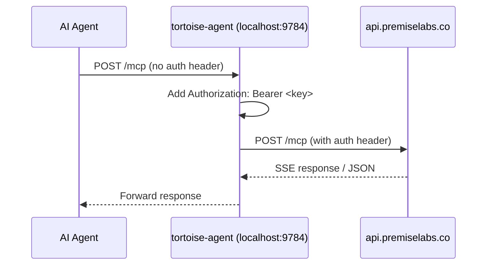

# Research: Tortoise Agent Daemon

**Date:** 2026-09-08
**Request:** Design a small background process (`tortoise-agent`) that holds an API key in memory, listens on localhost:9784, and proxies MCP requests from the user's agent to api.premiselabs.co.

## Problem reframing (Step 0)

- **Reframed:** This is a secure credential proxy daemon that eliminates the need for every agent harness to manage Tortoise API keys directly. Instead of handing the key to the agent (where it may leak into config files, session logs, or prompt context), the daemon holds the key in-process memory and the agent talks to localhost. The daemon is a *general-purpose MCP proxy* — not Tortoise-specific on the wire — but its *lifecycle and distribution* are Tortoise-specific (bundled with the installer, managed via `tortoise agent` CLI).
- **Domain classification:** Complicated (engineering). The pieces are well-understood: HTTP proxy, in-memory credential management, OS-level daemon lifecycle, MCP protocol transport. Integration surfaces with existing installer, CLI, session capture, and dashboard are where complexity lies.

---

## 1. MCP Proxy Reference Implementations

### 1.1 Apify `mcpc` — proxy mode

**Source:** [github.com/apify/mcpc](https://github.com/apify/mcpc), blog.apify.com

`mcpc` is a universal CLI client for MCP that runs as a shell command. Its proxy mode (`--proxy <port>`) exposes any stdio-based MCP server over HTTP on localhost.

**Key patterns:**
- `mcpc connect <server> @<session> --proxy 8080` — connects to a remote MCP server over Streamable HTTP, then exposes a local proxy on port 8080.
- AI-generated code in sandboxed environments talks to `localhost:8080` without ever seeing OAuth tokens.
- Uses OS keychain (Secret Service API on Linux, Keychain on macOS) for credential storage.
- Falls back to `~/.mcpc/credentials.json` (mode 0600) on headless/CI.
- The proxy is a *second-class feature* — it exists to sandbox credentials, not as the primary interface.

**Relevance:** The proxy pattern (local HTTP → remote MCP forwarding with credential isolation) is exactly what Tortoise needs. The key difference: Tortoise's daemon is the *primary* interface, not a sandboxing add-on.

### 1.2 punkpeye `mcp-proxy`

**Source:** [github.com/punkpeye/mcp-proxy](https://github.com/punkpeye/mcp-proxy), npm `mcp-proxy`

A TypeScript Streamable HTTP/SSE proxy for stdio-based MCP servers. Two modes:
1. **stdio → SSE/StreamableHTTP:** wraps a local stdio MCP server as an HTTP endpoint.
2. **SSE → stdio:** bridges remote SSE servers to local stdio clients.

**Key patterns:**
- `mcp-proxy http://remote-mcp-server.io/sse` — starts a local proxy that forwards to a remote SSE endpoint.
- Passes `Authorization` headers via `--headers` or `API_ACCESS_TOKEN` env var.
- Supports OAuth 2.1 client credentials flow.
- Configured in Claude Desktop's `mcpServers` stanza as a local command.

**Relevance:** The stdio→HTTP bridge pattern is the closest reference. Tortoise's daemon reverses this — it's an HTTP server (agent connects via Streamable HTTP) that proxies to a remote HTTP server. The header-forwarding pattern (Bearer token on every MCP request) is directly applicable.

### 1.3 sparfenyuk `mcp-proxy` (Python)

**Source:** [github.com/sparfenyuk/mcp-proxy](https://github.com/sparfenyuk/mcp-proxy), PyPI `mcp-proxy`

A Python implementation of the same proxy concept. Uses `uvx` as the default runner.

**Key patterns:**
- Two modes: stdio→SSE/StreamableHTTP and SSE→stdio.
- `--headers` for auth tokens, `--transport` flag to select protocol.
- Config-driven named servers via JSON file.

**Relevance:** Being Python (Tortoise's language), this is the most directly forkable/referenceable codebase. The architecture of wrapping stdio servers as HTTP endpoints is the same pattern.

### Synthesis

| Feature | mcpc (Apify) | mcp-proxy (punkpeye) | mcp-proxy (sparfenyuk) |
|---|---|---|---|
| Language | TypeScript | TypeScript | Python |
| Proxy direction | stdio→HTTP (sandbox) | stdio↔SSE/HTTP | stdio↔SSE/HTTP |
| Auth forwarding | Keychain → headers | `--headers`/env | `--headers`/env |
| Lifecycle | Manual CLI | Manual CLI | Manual CLI |
| Credential isolation | OS keychain | Env/CLI | Env/CLI |
| Localhost binding | Default | Default (`127.0.0.1`) | Configurable |

**None of these handle daemon lifecycle (launchd/systemd). That's the gap Tortoise fills.**

---

## 2. Simplest Implementation Architecture

### Option A: Pure HTTP proxy (recommended for v1)

The daemon is a minimal async HTTP server that:
1. Listens on `localhost:9784` for POST requests.
2. Forwards each POST to `https://api.premiselabs.co/mcp` with the in-memory `Authorization: Bearer <key>` header added.
3. Streams the response back to the agent.
4. Never reads the key from disk after initial load.



### Option B: stdio relay

The daemon exposes a stdio interface that agents talk to via subprocess. Less flexible — most modern agents prefer HTTP MCP endpoints.

**Verdict:** HTTP proxy (Option A) is the simplest and most compatible. The MCP Streamable HTTP transport is the standard, and every major agent harness (Claude Code, Cursor, Codex, OpenCode, Pi via MCP extension) supports connecting to an HTTP MCP endpoint.

### Protocol details

- The daemon serves on `http://localhost:9784/mcp` as a single POST endpoint (standard Streamable HTTP server endpoint).
- MCP protocol requires `Content-Type: application/json` on POST, and expects response as either JSON or SSE stream.
- The daemon MUST forward ALL request headers from the agent EXCEPT `Authorization` (which it overrides with its own in-memory token).
- The daemon MUST forward `MCP-Protocol-Version`, `Mcp-Method`, `Mcp-Name` headers (per MCP spec).
- The daemon does NOT need to parse or understand MCP messages — it's a transparent proxy.

---

## 3. Lifecycle Management

### 3.1 macOS: launchd

The existing `scripts/install-launchd.sh` provides the infrastructure. The daemon would:
- Install a `~/Library/LaunchAgents/co.premiselabs.tortoise-agent.plist` on install.
- Launchd auto-starts on login, restarts on crash (`KeepAlive` with `ThrottleInterval`), and runs as the user.
- The plist binds `SockNodeName` + `SockPathMode` for socket-activated localhost binding, OR sets `--port 9784` in `ProgramArguments`.

**Key launchd properties:**
```xml
<key>KeepAlive</key>
<true/>
<key>ThrottleInterval</key>
<integer>5</integer>
<key>RunAtLoad</key>
<true/>
<key>EnvironmentVariables</key>
<dict>
    <key>PATH</key>
    <string>/opt/homebrew/bin:/usr/local/bin:/usr/bin</string>
    <key>HOME</key>
    <string>/Users/&lt;user&gt;</string>
</dict>
```

### 3.2 Linux: systemd

User-level systemd service at `~/.config/systemd/user/tortoise-agent.service`:
```ini
[Unit]
Description=Tortoise Agent Daemon
After=network.target

[Service]
Type=simple
ExecStart=/usr/local/bin/tortoise-agent
Restart=always
RestartSec=5
Environment="HOME=%h"

[Install]
WantedBy=default.target
```

### 3.3 Auto-start via profile (fallback)

For environments without launchd/systemd (containers, WSL, minimal Linux):
```bash
# ~/.profile or ~/.bashrc
if ! pgrep -f "tortoise-agent"; then
    nohup tortoise-agent --daemonize >/dev/null 2>&1 &
fi
```

### 3.4 Port conflicts

- Default port: 9784 (registered at `IANA` / in-project convention).
- `--port` flag for override.
- Health check on startup: bind attempt fails fast with clear error.
- `tortoise agent status` reports the actual bound port.

### 3.5 Crash resilience

- `KeepAlive` (launchd) / `Restart=always` (systemd) handles the process crash case.
- Graceful shutdown on `SIGTERM` (flush pending writes, close key memory).
- PID file at `~/.tortoise/agent.pid` for non-service-managed environments.

---

## 4. Session Capture Integration

The daemon sees every MCP call because it proxies every request. This is a natural hook for session capture.

### How it works

1. Every HTTP request arriving at `localhost:9784/mcp` is visible to the daemon.
2. The daemon can journal request/response pairs to `~/.tortoise/sessions/` — a JSONL event stream of MCP calls.
3. These session logs are consumed by the existing `session-postmortem.sh` infrastructure (`scripts/session-postmortem.sh`).

### Integration point

The daemon doesn't need to *understand* MCP messages to capture sessions — it just needs to log the raw HTTP bodies:
```json
{"ts": "...", "method": "tools/call", "params": {...}, "result": {...}}
```

### v1 scope

In v1, session capture is OFF by default (avoid surprising users with file writes). It becomes opt-in via `tortoise agent config set session-capture true`. Phase 3 (plan) makes it built-in.

### Security consideration

Session logs contain the full MCP request/response — potentially including sensitive data in tool parameters or results. The log file must be `~/.tortoise/sessions/` with mode 0600, and rotation must be built in (max 10MB, oldest rotated out).

---

## 5. Offline Resilience

### Problem

The daemon proxies to api.premiselabs.co. If the network is down, the daemon can't forward requests. But the user's agent still tries to connect — MCP returns an error immediately.

### v1 behavior (fail-fast)

- Daemon detects network unavailability → returns HTTP 502 (Bad Gateway) to the agent.
- Agent sees the error and retries (MCP client built-in retry or user re-prompt).
- No buffer, no replay — keep it simple.

### v2 behavior (buffer + replay)

- Daemon detects network unavailability → buffers requests to a capped JSONL file (`~/.tortoise/outbox/`).
- On reconnect, replays buffered writes in order.
- Hard cap: 1000 entries or 10MB, whichever hits first (oldest dropped).
- This is useful for *session capture writes* (non-critical) and *read-only graph mutations* if those exist. Write mutations (create_point, etc.) still fail — stale writes are worse than no writes.

### Decision

Fail-fast for v1 (phase 1-3). Buffer writes (offline resilience) is phase 4.

---

## 6. CLI Surface Design

All commands under `tortoise agent`:

| Command | Description |
|---|---|
| `tortoise agent start` | Launch the daemon (install + start if not running) |
| `tortoise agent stop` | Graceful shutdown (SIGTERM) |
| `tortoise agent status` | Running? PID? Port? Uptime? Key status? |
| `tortoise agent restart` | Stop then start |
| `tortoise agent logs` | Tail daemon logs |
| `tortoise agent config` | View/set config (port, session-capture, etc.) |

These map to the existing `__main__.py` CLI parser (`python -m tortoise agent <subcommand>`).

---

## 7. Minimum Viable Implementation

### Estimated effort: 3-4 weeks (one engineer)

| Component | Effort | Dependencies |
|---|---|---|
| Core daemon (aiohttp HTTP proxy) | 3 days | asyncio, aiohttp |
| In-memory key management | 1 day | env var ← API key at start |
| `tortoise agent` CLI subcommands | 2 days | argparse, existing `__main__.py` |
| launchd plist + installer integration | 2 days | install-launchd.sh pattern |
| systemd user service | 1 day | template .service file |
| Health + status endpoint | 1 day | daemon serves GET /health |
| Session capture (v1 opt-in) | 2 days | JSONL writer, rotation |
| Offline resilience (v2) | 3 days | outbox buffer, replay |
| Cross-platform testing | 3 days | macOS + Linux CI |
| Documentation | 1 day | README, CLI --help |
| **Total (v1, no session capture)** | **~2 weeks** | |
| **Total (v1 + session capture)** | **~3 weeks** | |
| **Total (v1–v3)** | **~4 weeks** | |

### v1 is:

1. A single Python script (`tortoise-agent` or `tortoise/agent_daemon.py` + `__main__.py` entry)
2. Uses aiohttp for async HTTP proxy
3. Accepts API key via env var `TORTOISE_API_KEY` (daemon reads it at startup, never writes it)
4. Listens on localhost:9784
5. Forwards POST `/mcp` to api.premiselabs.co
6. `tortoise agent start|stop|status` CLI commands
7. launchd plist installation (macOS)
8. systemd user service installation (Linux)
9. Health endpoint at `GET /health`

### Not in v1:

- Session capture
- Offline resilience / outbox buffer
- Dashboard integration (health reports, session list)
- Multi-key management
- TLS termination (localhost-only, no TLS needed)

---

## 8. Key Design Decisions

### 8.1 Python vs compiled binary

**Decision: Python.** The daemon runs in the user's environment alongside the SDK. Python is already a dependency (Tortoise SDK is Python). The daemon can be a small aiohttp server in `tortoise/agent_daemon.py`. This avoids shipping a separate binary, keeps the codebase homogeneous, and simplifies debugging.

**Tradeoff:** Python startup latency (~100ms) is irrelevant for a long-running daemon. Memory overhead (~30MB for the Python runtime) is acceptable for a background process.

### 8.2 Single-threaded async vs multi-threaded

**Decision: Single-threaded asyncio (aiohttp).** MCP requests are I/O-bound (waiting on the remote API). A single event loop handles concurrent requests efficiently. No thread pool needed.

### 8.3 Key injection: env var vs file-based

**Decision: Environment variable (phase 1), then Stdin-based injection (phase 2).**

The installer (`curl ... | bash`) currently prints the API key discovery step. For the daemon:
1. Installer starts the daemon with `TORTOISE_API_KEY=<key> tortoise-agent start`.
2. Daemon reads `TORTOISE_API_KEY` on startup, stores it in a `_key: str` attribute, cleans the env var from its own environment.
3. Never writes the key to disk.
4. `tortoise agent status` reports `key: loaded` without revealing the key.

### 8.4 Configuration mechanism

**Decision: `~/.tortoise/config.toml` (created by `tortoise agent config`).**

Toml for consistency with existing project config patterns. Contains only non-secret config:
```toml
[daemon]
port = 9784
session_capture = false
log_level = "info"
```

The API key is NEVER in this file.

---

## 9. Open Questions

1. **How does the installer pass the API key to the daemon without exposing it in the process table?** `curl ... | bash` starts the daemon as `TORTOISE_API_KEY=... tortoise-agent start` — the key is briefly visible in `ps`. Mitigation: the daemon unsetenvs `TORTOISE_API_KEY` immediately on startup. Acceptable for v1; revisit if key exfiltration via `/proc` is a real threat.
2. **Should the daemon support multiple API keys?** (No — multi-key = multi-daemon-instance, or key rotation. The API handles multi-graph via different keys sent by different agents.)
3. **Should the daemon validate the key on startup?** (Yes — `GET /v1/me` or similar to verify the key is valid before accepting proxy requests. Fail fast with clear error.)
4. **Port collision handling?** (Auto-increment on conflict? Or fail with "port 9784 in use"? Fail-first with clear error is safer — the user explicitly chose a port or accepted the default.)

---

## Sources

- [github.com/apify/mcpc](https://github.com/apify/mcpc) — Apify's universal MCP CLI client with proxy mode
- [blog.apify.com/introducing-mcpc-universal-mcp-cli-client/](https://blog.apify.com/introducing-mcpc-universal-mcp-cli-client/) — Proxy for AI sandboxes
- [github.com/punkpeye/mcp-proxy](https://github.com/punkpeye/mcp-proxy) — TypeScript MCP proxy stdio↔HTTP
- [github.com/sparfenyuk/mcp-proxy](https://github.com/sparfenyuk/mcp-proxy) — Python MCP proxy
- [modelcontextprotocol.io/specification/2026-07-28/basic/transports/streamable-http](https://modelcontextprotocol.io/specification/2026-07-28/basic/transports/streamable-http) — MCP Streamable HTTP spec (auth headers, request metadata)
- Apple Developer: [Creating Launch Daemons and Agents](https://developer.apple.com/library/archive/documentation/MacOSX/Conceptual/BPSystemStartup/Chapters/CreatingLaunchdJobs.html) — launchd lifecycle patterns
- `scripts/install-launchd.sh` in-repo — existing launchd template installer